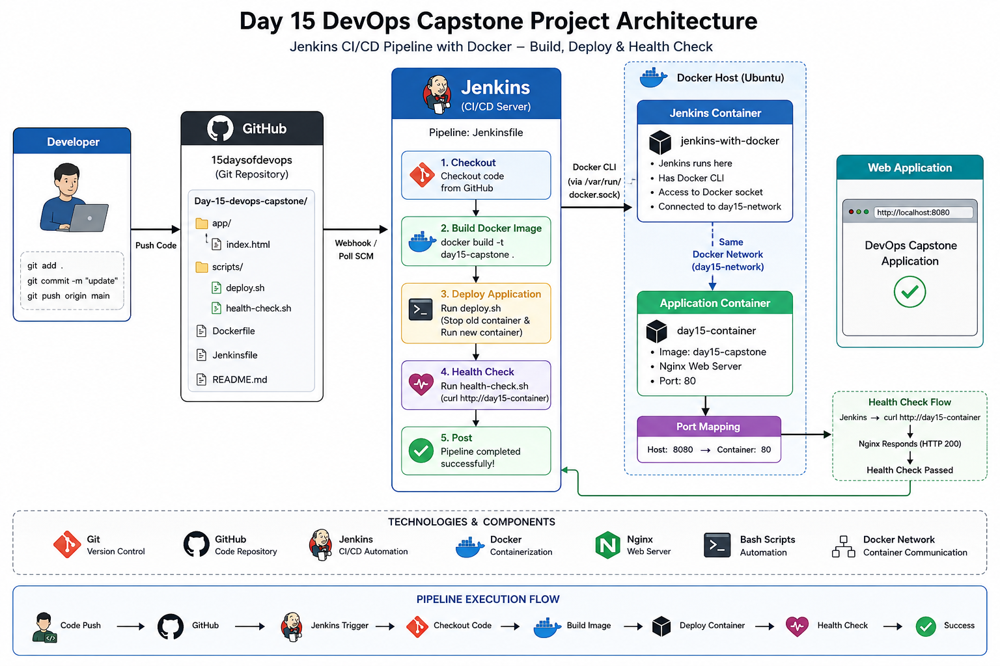
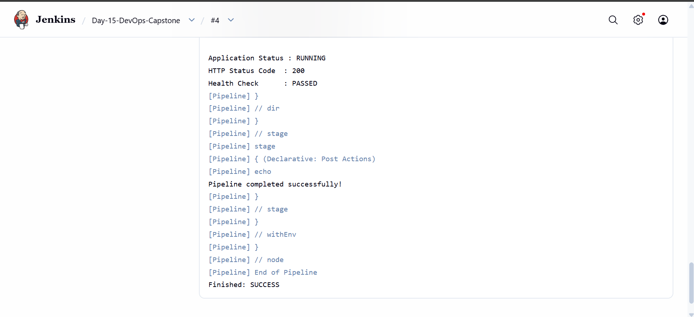
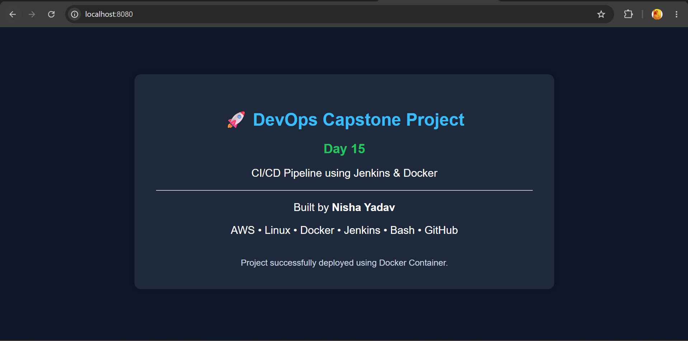
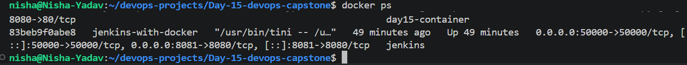
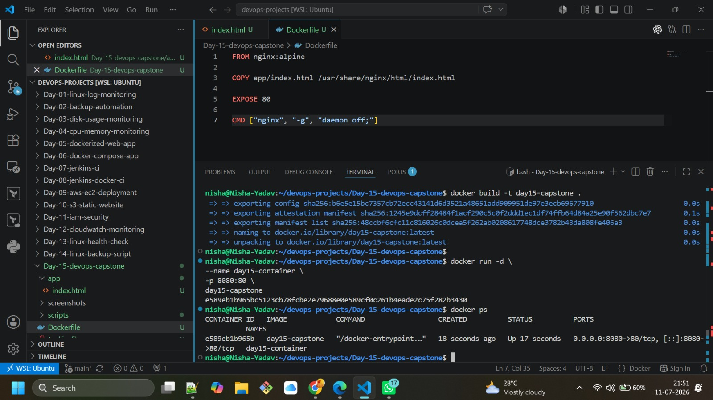

# 🚀 Day 15 - DevOps Capstone Project

## 📌 Project Overview

This project demonstrates a complete **CI/CD (Continuous Integration & Continuous Deployment) pipeline** using **Jenkins** and **Docker**.

The pipeline automatically performs the following tasks:

- Checkout source code from GitHub
- Build a Docker image
- Deploy the application as a Docker container
- Perform an automated health check
- Report pipeline status

This project showcases the complete deployment lifecycle of a containerized web application using Jenkins Pipeline as Code.

---

# 🏗️ Architecture



---

# 🚀 CI/CD Workflow

```
Developer
    │
    ▼
Git Push
    │
    ▼
GitHub Repository
    │
    ▼
Jenkins Pipeline
    │
    ├── Checkout Source Code
    ├── Build Docker Image
    ├── Deploy Docker Container
    └── Run Health Check
    │
    ▼
Docker Container
    │
    ▼
Nginx Web Application
```

---

# 🛠️ Tech Stack

- Jenkins
- Docker
- Docker Network
- Nginx
- Git
- GitHub
- Bash Scripting
- Linux (Ubuntu)

---

# 📂 Project Structure

```
Day-15-devops-capstone/
│
├── app/
│   └── index.html
│
├── scripts/
│   ├── deploy.sh
│   └── health-check.sh
│
├── screenshots/
│   ├── architecture.png
│   ├── app-running.png
│   ├── docker-containers.png
│   ├── docker-images.png
│   ├── jenkins-dashboard.png
│   ├── pipeline-success.png
│   └── pipeline-console-output.png
│
├── Dockerfile
├── Jenkinsfile
├── README.md
└── .gitignore
```

---

# ⚙️ Pipeline Stages

## 1️⃣ Checkout

Downloads the latest source code from the GitHub repository.

---

## 2️⃣ Build Docker Image

Builds the Docker image using the project's Dockerfile.

```bash
docker build -t day15-capstone .
```

---

## 3️⃣ Deploy Application

Runs the deployment script which:

- Stops the old container
- Removes the old container
- Starts a new container
- Exposes the application on port **8080**

```bash
./scripts/deploy.sh
```

---

## 4️⃣ Health Check

Runs an automated health check using curl.

```bash
./scripts/health-check.sh
```

The pipeline succeeds only if the application returns:

```
HTTP Status Code : 200
```

---

# 🖥️ Docker Commands Used

Build Image 

```bash
docker build -t day15-capstone .
```

Run Container

```bash
docker run -d \
--name day15-container \
--network day15-network \
-p 8080:80 \
day15-capstone
```

Check Running Containers

```bash
docker ps
```

View Docker Images

```bash
docker images
```

---

# 📸 Project Screenshots

## Jenkins Dashboard

![Jenkins Dashboard] (image-2.png)

---

## Successful Pipeline

![Pipeline Success] (image-3.png)

---

## Pipeline Console Output



---

## Running Application



---

## Docker Containers



---

## Docker Build



---

# ▶️ How to Run

## Clone Repository

```bash
git clone https://github.com/nishayadav29/15daysofdevops.git
```

Navigate to the project

```bash
cd Day-15-devops-capstone
```

Build Docker Image

```bash
docker build -t day15-capstone .
```

Deploy

```bash
./scripts/deploy.sh
```

Run Health Check

```bash
./scripts/health-check.sh
```

Access the application

```
http://localhost:8080
```

---

# 🎯 Learning Outcomes

Through this project, I gained hands-on experience with:

- Jenkins Pipeline as Code
- Docker image creation
- Container deployment automation
- Docker networking
- Bash scripting
- Automated health checks
- CI/CD best practices
- Git & GitHub integration

---

# 🚀 Future Enhancements

- Add Docker Compose
- Integrate Kubernetes deployment
- Add Prometheus & Grafana monitoring
- Implement Blue-Green deployment
- Add automated rollback on failure

---

# 👩‍💻 Author

**Nisha Yadav**

Aspiring DevOps Engineer

### Connect with me

- GitHub: https://github.com/nishayadav29

---

⭐ If you found this project helpful, consider giving it a star!